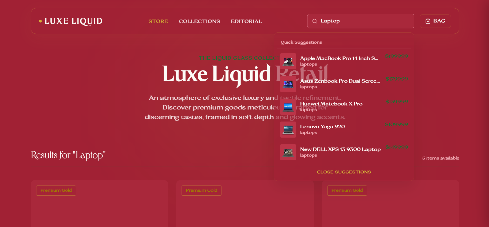
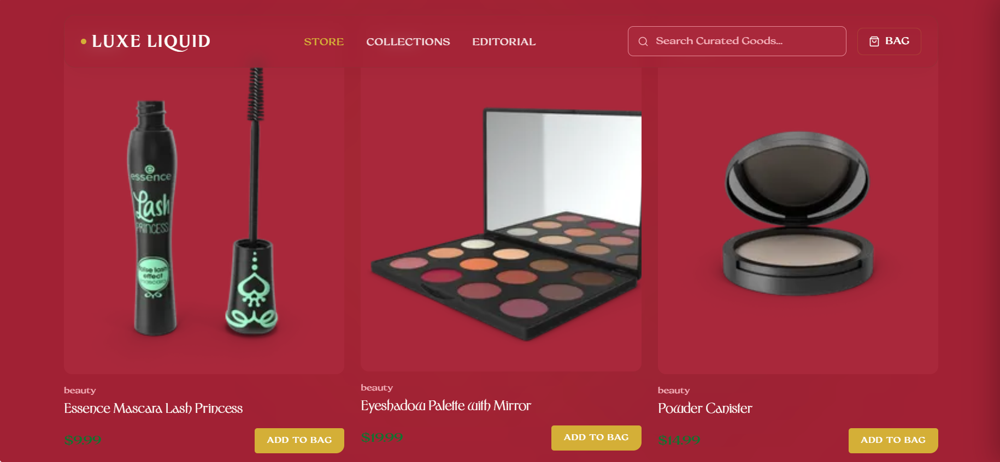
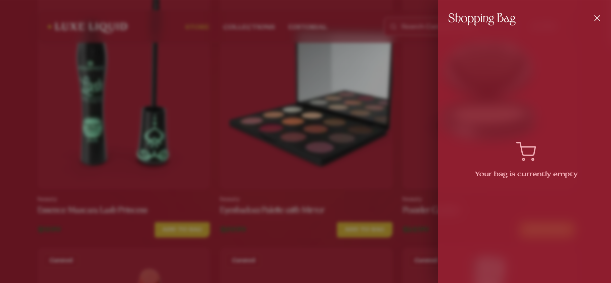
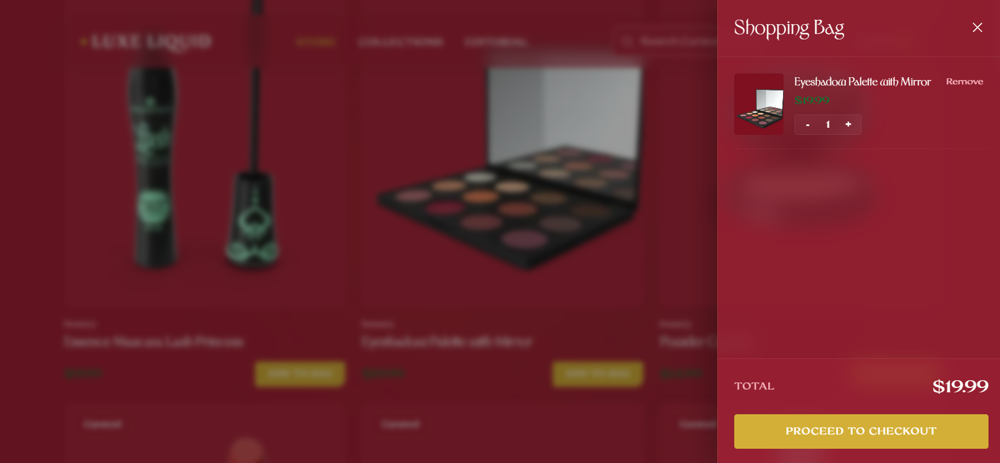
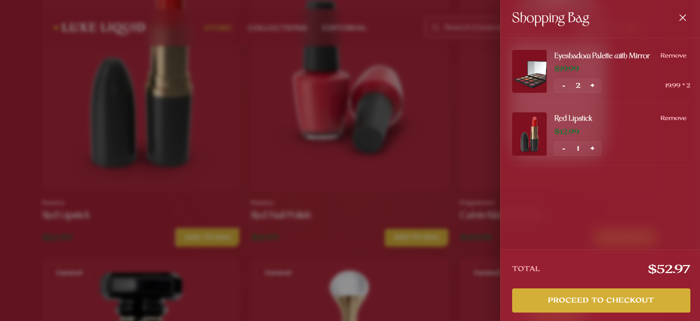
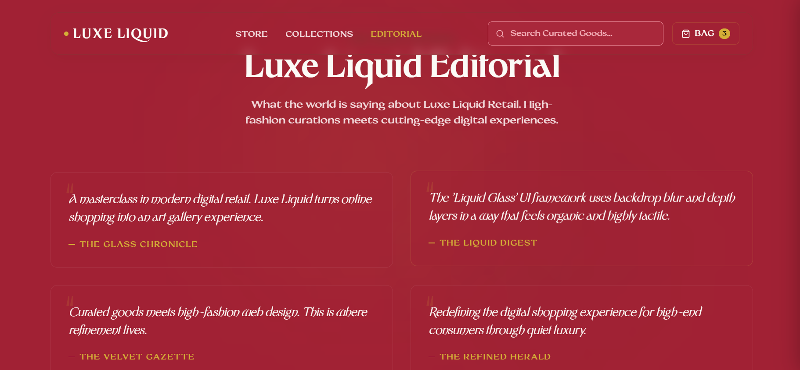
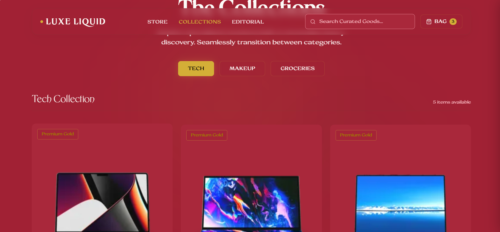
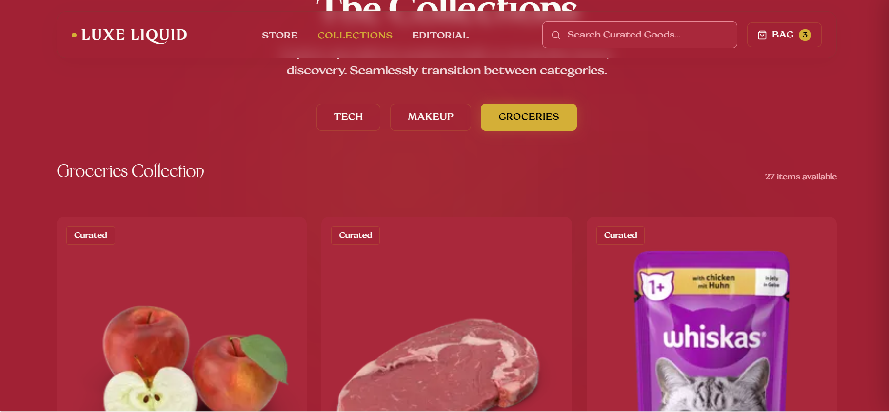

# Luxe Liquid: Elegant Auto-Suggestion Search

An elegant, high-end e-commerce interface with an advanced, debounced **Auto-Suggestion Search** system. Designed with a luxury visual identity ("Luxe Liquid") featuring ambient glow filters, liquid glassmorphism, responsive grids, and an interactive shopping bag checkout experience.

---

## Visual Previews

Here you can showcase the elegant user interface of Luxe Liquid. Replace the placeholder links below with your screenshots.

### Search & Auto-Suggestions
*Experience real-time debounced results as you type with the luxury glassmorphic dropdown.*

 


### Product Catalog & Liquid Glass Navbar
*Browse through premium collections (Tech, Makeup, Groceries) styled with custom hover effects.*


 


### Shopping Bag Drawer
*Manage your selected items, increment/decrement quantities, and check the real-time subtotal in the sliding side-drawer.*

*First- Without any items*
 

*Next- With an item*
 

*Next- With multiple items*
 

### Editorial Section
*Reviews left by prominent customers.*
 

### Collections
*Items categorised into various collections*

**Tech Collection**


**Groceries collection**
 


## Features

- **Debounced Auto-Suggestion**: Searches the `dummyjson.com` product API with a 400ms debounce to limit network requests.
- **Glassmorphic Navigation Bar**: Implements a sticky nav with background blur (`backdrop-filter`) and gold hover effects.
- **Collection Tabs**: Categorizes product catalog items dynamically into **Tech**, **Makeup**, and **Groceries** views.
- **Sliding Shopping Bag Drawer**: Sliding drawer to add, update quantity, remove items, and calculate the total price in real time.
- **Micro-Animations**: Clean, premium transitions on cards, buttons, input fields, and hover states.
- **Fully Responsive**: Optimized for desktop, tablet, and mobile views.

---

## Tech Stack

- **Framework**: React 19 + Vite 8 (with React Compiler enabled for optimal rendering performance)
- **Styling**: Vanilla CSS (variables, glassmorphic styles, custom utility classes)
- **Data Source**: [DummyJSON API](https://dummyjson.com)

---

## Getting Started

Follow these steps to run the application locally:

### 1. Clone the Repository
```bash
git clone https://github.com/yourusername/Auto-suggestion-search.git
cd Auto-suggestion-search
```

### 2. Install Dependencies
```bash
npm install
```

### 3. Run Development Server
```bash
npm run dev
```
The application will be running at `http://localhost:5173`.

### 4. Build for Production
```bash
npm run build
```

---

## 📂 Project Structure

```
Auto-suggestion-search/
├── src/
│   ├── components/
│   │   └── AutoSuggestion.jsx  # Main search & store page component
│   ├── assets/                 # Local assets and icons
│   ├── App.jsx                 # App root component
│   ├── App.css                 # Page layout & drawer css styles
│   ├── index.css               # Design tokens, variables & base css
│   └── main.jsx                # Entry point
├── public/                     # Public assets
├── .gitignore                  # Git ignore files and directories
├── package.json                # Project dependencies and scripts
└── README.md                   # Project documentation
```
